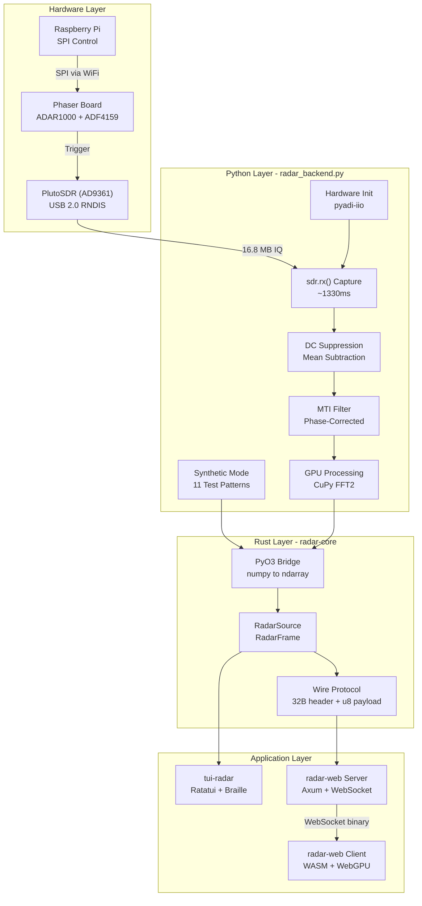

# Aleph Radar System: Comprehensive Reference

This document is the authoritative reference for the aleph-phaser repository. It consolidates all architecture decisions, implementation details, performance data, and known constraints into a single source of truth for AI-agent-assisted development.

**Last updated:** 2026-02-08 (evening session: axis alignment, Mac demos, iiod proxy, shared config)
**Repository:** `aleph-phaser`
**Branch context:** `feat/doppler-radar-tui`

---

## 1. Project Identity and Purpose

This repository integrates the Analog Devices CN0566 Phaser X-band phased array radar development kit with the Elodin Aleph edge compute platform (NVIDIA Jetson Orin NX 16GB). The project demonstrates that running the Phaser on the Aleph instead of the original Raspberry Pi enables GPU-accelerated radar signal processing -- real-time range-Doppler maps, CFAR target detection, and micro-Doppler analysis -- that would be impractical on the Pi.

The system has two primary visualization frontends:

1. **TUI Radar** (`apps/tui-radar/`) -- A Rust terminal application using Ratatui with braille-character heatmaps, designed for SSH sessions. Ideal for headless operation.
2. **Radar Web** (`apps/radar-web/`) -- An Axum web server streaming frames over WebSocket to a WASM/WebGPU browser client. Provides high-fidelity, interactive range-Doppler visualization from any browser on the LAN.

Both frontends share a common Rust library (`libs/radar-core/`) that bridges to a Python radar backend (`radar_backend.py`) via PyO3.

### Hardware Topology

```
+-------------------------+     USB 2.0 (RNDIS)     +-------------------+
|  Aleph (Orin NX 16GB)  |<========================>|    PlutoSDR       |
|  192.168.4.186 (WiFi)  |   ip:192.168.2.1         |  (ADALM-PLUTO)   |
|                         |   16.8 MB per capture    |  USB-Eth gadget   |
|  - Rust apps (TUI/Web) |                          +-------------------+
|  - Python radar backend |
|  - CuPy GPU processing  |     WiFi (SPI control)  +-------------------+
|  - NixOS deployment     |<========================>|  Raspberry Pi     |
+-------------------------+   ip:192.168.4.184       |  192.168.4.184    |
                                                     |  - ADAR1000 x2    |
                                                     |  - ADF4159 PLL    |
                                                     |  - SPI bridge     |
                                                     +-------------------+
```

| Device | Address | Connection | Role |
|--------|---------|------------|------|
| Aleph | 192.168.4.186 | WiFi (wlan0) | Compute: FFT, GPU, visualization |
| PlutoSDR | 192.168.2.1 | USB-Ethernet (RNDIS) | ADC: IQ sample capture |
| Raspberry Pi | 192.168.4.184 | WiFi | SPI control of beamformers and PLL |

The PlutoSDR connects directly to the Aleph via a powered USB 3.0 hub (though the Pluto itself is USB 2.0). Data does NOT flow through the Raspberry Pi. The Pi is only used for low-bandwidth SPI control of the ADAR1000 beamformer chips and ADF4159 frequency synthesizer.

### Development Environment

All development happens inside a Nix develop shell:

```bash
nix develop                          # Enter dev shell
cargo build --release                # Build all crates
cargo run -p tui-radar -- --synthetic  # Run TUI in synthetic mode
cargo run -p radar-web -- --synthetic  # Run web server in synthetic mode
```

Deployment to the Aleph:

```bash
ssh-add ssh/aleph-phaser
./deploy.sh -h 192.168.4.186 -u aleph-phaser
```

---

## 2. Repository Layout

```
aleph-phaser/
|-- Cargo.toml                    # Workspace root (resolver = "2")
|-- Cargo.lock                    # Shared lockfile
|-- flake.nix                     # NixOS config, overlays, devShell
|-- flake.lock
|-- deploy.sh                     # NixOS deployment script
|-- justfile                      # Task runner
|
|-- libs/
|   +-- radar-core/               # SHARED LIBRARY (Rust + Python)
|       |-- Cargo.toml
|       |-- build.rs              # PyO3 build config
|       |-- src/
|       |   |-- lib.rs            # Public API: RadarSource, re-exports
|       |   |-- backend.rs        # PyO3 bridge to radar_backend.py
|       |   |-- config.rs         # RadarConfig, RadarMode
|       |   |-- error.rs          # RadarError enum
|       |   |-- frame.rs          # RadarFrame, FrameData, FrameDimensions
|       |   |-- patterns.rs       # TestPattern enum (11 patterns)
|       |   +-- protocol.rs       # Wire protocol: FrameHeader, EncodedFrame
|       +-- python/
|           |-- radar_backend.py  # Main backend (1719 lines, hardware + synthetic + GPU)
|           |-- test_patterns.py  # Pattern validation script
|           |-- validate_hardware.py
|           |-- validate_web_pipeline.py
|           +-- capture_one_frame.py
|
|-- apps/
|   |-- tui-radar/                # TERMINAL UI APPLICATION
|   |   |-- Cargo.toml            # Depends on radar-core
|   |   |-- src/
|   |   |   |-- main.rs           # Entry point, CLI (clap), main loop
|   |   |   |-- app.rs            # App state, update cycle, spectra
|   |   |   |-- config.rs         # TUI config -> radar-core config
|   |   |   |-- data/mod.rs       # DataSource wrapper around RadarSource
|   |   |   |-- processing/mod.rs # Placeholder (processing in Python)
|   |   |   +-- ui/
|   |   |       |-- mod.rs        # UI module exports
|   |   |       |-- dashboard.rs  # Layout: header, heatmap, spectra, controls
|   |   |       |-- heatmap.rs    # Braille heatmap with bilinear interpolation
|   |   |       |-- spectrum.rs   # 1D range/Doppler spectrum plots
|   |   |       +-- colormap.rs   # Inferno, Plasma, Viridis, Magma LUTs
|   |   +-- analyze_capture.py
|   |
|   +-- radar-web/                # WEB VISUALIZATION APPLICATION
|       |-- Cargo.toml            # Depends on radar-core
|       |-- src/
|       |   |-- main.rs           # Axum server entry, CLI (clap)
|       |   |-- config.rs         # Server config
|       |   +-- server/
|       |       |-- mod.rs        # Server setup, frame acquisition thread
|       |       |-- broadcast.rs  # Frame + state broadcast channels
|       |       |-- routes.rs     # HTTP routes (/api/status, /api/config)
|       |       +-- websocket.rs  # WebSocket handler (/ws/frames)
|       |-- static/
|       |   |-- index.html        # HTML shell for WASM client
|       |   |-- radar_web_client.js
|       |   |-- radar_web_client_bg.wasm
|       |   +-- package.json
|       +-- client/               # WASM CLIENT (separate crate)
|           |-- Cargo.toml        # wgpu, wasm-bindgen (pinned 0.2.100)
|           +-- src/
|               |-- lib.rs        # WASM entry point
|               |-- app.rs        # Main loop, input handling, state
|               |-- protocol.rs   # Frame decoding (FrameHeader, RadarFrame)
|               |-- websocket.rs  # FrameClient (binary + JSON channels)
|               +-- renderer/
|                   |-- mod.rs    # WebGPU renderer orchestration
|                   |-- pipeline.rs  # Render pipeline, bind groups
|                   |-- texture.rs   # R8Unorm radar texture
|                   |-- colormap.rs  # 1D RGBA colormap LUT (256 entries)
|                   +-- shaders.wgsl # Vertex/fragment shaders, grid overlay
|
|-- nix/
|   |-- modules/
|   |   |-- radar-config.nix      # Shared radar parameters (single source of truth)
|   |   |-- python-env.nix        # Unified Python env (numpy, scipy, CuPy, pyadi-iio)
|   |   |-- plutosdr.nix          # PlutoSDR support, udev, iiod proxy
|   |   +-- radar-web.nix         # radar-web systemd service
|   +-- pkgs/
|       |-- tui-radar.nix         # Rust build + Python wrapper
|       |-- radar-web.nix         # Rust build + WASM client + wrapper
|       |-- cupy.nix              # CuPy 13.6.0 pre-built wheel (aarch64)
|       |-- pylibiio.nix          # Python IIO bindings
|       |-- pyadi-iio.nix         # ADI hardware control library
|       |-- phaser-data.nix       # Filter files + demo scripts deployment
|       +-- test-plutosdr.nix     # PlutoSDR test tool
|
|-- scripts/
|   |-- gpu-demos/                # GPU-accelerated demo scripts
|   |   |-- gpu_benchmark.py      # Performance comparison dashboard
|   |   |-- gpu_range_doppler.py  # Range-Doppler with CuPy
|   |   |-- gpu_range_doppler_jon.py  # Jon Kraft's modified pipeline
|   |   |-- gpu_cfar.py           # CFAR target detection
|   |   |-- gpu_micro_doppler.py  # Micro-Doppler spectrograms
|   |   |-- run_gpu_demo.py       # Full demo suite runner
|   |   |-- test_hb100_jon_headless.py  # Headless hardware test
|   |   |-- test_hb100_direct.py
|   |   +-- gpu_utils/            # Shared GPU utilities
|   |       |-- cupy_signal.py    # GPU FFT, CFAR, STFT, fallback to NumPy
|   |       +-- visualization.py  # Headless matplotlib plotting
|   |-- cpu-demos/                # CPU-only demo scripts
|   +-- mac/                      # Mac demos (run from nix develop shell over network)
|       |-- CW_RADAR_Waterfall_Mac.py
|       |-- FMCW_RADAR_Waterfall_Mac.py
|       |-- CFAR_RADAR_Waterfall_Mac.py
|       |-- Range_Doppler_Plot_Mac.py  # ADI reference for validation
|       +-- README.md
|
|-- context/                      # Design docs, session summaries, references
|-- references/                   # Hardware datasheet summaries
|-- data/                         # Calibration + filter files
|-- exports/                      # Captured frames and comparison plots
+-- ssh/                          # Deployment SSH keys
```

### Cargo Workspace

```toml
# /Cargo.toml
[workspace]
resolver = "2"
members = [
    "libs/radar-core",
    "apps/tui-radar",
    "apps/radar-web",
    "apps/radar-web/client",
]

[workspace.dependencies]
pyo3 = { version = "0.22", features = ["auto-initialize"] }
ndarray = "0.16"
thiserror = "2"
serde = { version = "1", features = ["derive"] }
serde_json = "1"
```

---

## 3. Architecture Overview



### Data Flow Summary

1. **Hardware capture**: GPIO burst trigger -> PlutoSDR `sdr.rx()` -> 2 channels x 2.1M samples (16.8 MB)
2. **Preprocessing**: Channel sum -> reshape into chirps (vectorized indexing) -> DC suppression -> optional MTI
3. **GPU processing**: CuPy `fft2` + `fftshift` + `abs` + `log10` + `clip` (~58ms steady state)
4. **PyO3 transfer**: NumPy `tobytes()` + `bytemuck` cast -> `ndarray::Array2<f32>` (zero-copy)
5. **Frame encoding**: `RadarFrame` -> `EncodedFrame` (float32 to u8 quantization, 32-byte header)
6. **Transport**: WebSocket binary broadcast (921 KB full-res, 15 KB sliced)
7. **Rendering**: WebGPU texture upload -> colormap shader -> canvas (TUI: braille heatmap)

---

## 4. radar-core Library

**Location:** `libs/radar-core/`
**Crate name:** `radar_core`
**Role:** Shared library providing the PyO3 bridge, type definitions, and wire protocol used by both TUI and Web applications.

### Public Types

#### RadarConfig (`config.rs`)

```rust
pub struct RadarConfig {
    pub mode: RadarMode,           // Hardware | Synthetic (default: Synthetic)
    pub sdr_uri: String,           // default: "ip:192.168.2.1"
    pub phaser_uri: String,        // default: "ip:192.168.4.184"
    pub sample_rate: u64,          // default: 4_000_000 Hz
    pub n_doppler: usize,          // default: 256 (num_chirps)
    pub ramp_time_us: u32,         // default: 500
    pub chirp_bw: f64,             // default: 500_000_000 Hz
    pub center_freq: u64,          // default: 2_100_000_000 Hz
    pub output_freq: u64,          // default: 9_900_000_000 Hz
    pub rx_gain: i32,              // default: 30 dB
    pub max_range: f64,            // default: 10.0 m
    pub target_fps: u32,           // default: 30
    pub test_pattern: TestPattern, // default: Animated
}
```

Computed methods: `range_resolution()` (0.3m), `n_range_full()` (1800), `max_doppler()`, `doppler_resolution()`, `max_unambiguous_range()`.

Factory methods: `RadarConfig::synthetic(pattern)`, `RadarConfig::hardware(sdr_uri, phaser_uri)`.

#### RadarSource (`lib.rs` / `backend.rs`)

The primary entry point. Wraps `PythonBackend` and provides all frame acquisition methods.

```rust
impl RadarSource {
    pub fn new(config: RadarConfig) -> Result<Self, RadarError>;
    pub fn get_frame() -> Result<RadarFrame, RadarError>;         // Sliced (n_doppler x n_range)
    pub fn get_frame_full() -> Result<RadarFrame, RadarError>;    // Full-res (n_doppler x n_range_full)
    pub fn capture_raw() -> Result<Array2<f32>, RadarError>;      // Raw sliced data
    pub fn capture_raw_full() -> Result<Array2<f32>, RadarError>; // Raw full-res data
    pub fn set_mti_enabled(enabled: bool) -> Result<(), RadarError>;
    pub fn set_test_pattern(pattern: TestPattern) -> Result<(), RadarError>;
    pub fn cycle_test_pattern() -> Result<TestPattern, RadarError>;
    pub fn export_frame(directory: &str) -> Result<PathBuf, RadarError>;
    pub fn dimensions() -> FrameDimensions;      // Sliced
    pub fn dimensions_full() -> FrameDimensions; // Full-resolution
    pub fn scale_range() -> (f32, f32);          // (min_scale, max_scale) in log10
    pub fn is_synthetic() -> bool;
    pub fn shutdown();
}
```

**Critical threading constraint:** `RadarSource` is `!Send` because it holds a `Py<PyAny>` (Python object via PyO3). Frame acquisition MUST run on a dedicated `std::thread`, NOT a tokio task. The radar-web server uses `std::thread::spawn` for the acquisition loop and `mpsc::sync_channel` to communicate with the async runtime.

#### RadarFrame (`frame.rs`)

```rust
pub struct RadarFrame {
    pub dimensions: FrameDimensions,  // n_doppler x n_range
    pub format: FrameFormat,          // Float32 | UInt8 | UInt16
    pub data: FrameData,              // Row-major (Doppler x Range)
    pub scale_min: f32,               // Min value in log10 (typically 0.0)
    pub scale_max: f32,               // Max value in log10 (typically 8.0)
    pub range_min_m: f32,
    pub range_max_m: f32,
    pub doppler_min_hz: f32,
    pub doppler_max_hz: f32,
    pub mti_enabled: bool,
}
```

Methods: `to_u8()` (quantize), `get(d, r)`, `as_f32_slice()`, `as_u8_slice()`, `range_for_bin()`, `doppler_for_bin()`.

#### Wire Protocol (`protocol.rs`)

Binary frame format for WebSocket transport:

```
HEADER (32 bytes, #[repr(C, packed)]):
  Offset  Type   Field
  0       u8     message_type (0x01 = radar_frame)
  1       u8     frame_type (0x00 = range_doppler)
  2       u16    n_doppler
  4       u16    n_range
  6       u8     value_format (0=u8, 1=u16, 2=f32)
  7       u8     flags (bit0 = MTI enabled)
  8       f32    scale_min
  12      f32    scale_max
  16      f32    range_min_m
  20      f32    range_max_m
  24      f32    doppler_min_hz
  28      f32    doppler_max_hz

PAYLOAD: n_doppler * n_range * bytes_per_sample (row-major)

Full-res frame:  32 + (512 x 1800 x 1) = 921,632 bytes (~900 KB)
Sliced frame:    32 + (512 x 30 x 1)   = 15,392 bytes (~15 KB)
```

All multi-byte fields are little-endian. The `EncodedFrame` type provides `from_frame()`, `to_bytes()`, `from_bytes()` for serialization.

#### TestPattern (`patterns.rs`)

Eleven synthetic patterns for UI validation: `Animated`, `CornerDots`, `GradientH`, `GradientV`, `CenterTarget`, `Grid`, `Diagonal`, `Checkerboard`, `Hb100Stationary`, `Hb100Walking`, `DcLeakage`.

Each has a stable string name (matches Python backend), `next()`/`prev()` for cycling, and a human-readable `description()`.

#### PyO3 Bridge Mechanism (`backend.rs`)

- Initialization: adds Python paths from `RADAR_BACKEND_PATH` env var, dev paths (`libs/radar-core/python/`), and deployed path (`/opt/phaser/lib/python/`). Imports `radar_backend` module and calls `create_backend(**kwargs)`.
- Data transfer: `numpy_to_array2()` calls `np.ascontiguousarray(array).tobytes()` in Python, receives raw bytes, casts via `bytemuck::cast_slice` to `&[f32]`, builds `Array2<f32>`. This avoids creating 900k+ Python objects that `.tolist()` would produce.
- GPU status: logged at init via `tracing::info!`.

### Dependencies

Runtime: `pyo3 0.22`, `ndarray 0.16`, `bytemuck 1.14`, `thiserror 2`, `serde 1`, `serde_json 1`, `tracing 0.1`.
Build: `pyo3-build-config 0.22`.

---

## 5. Python Radar Backend

**Location:** `libs/radar-core/python/radar_backend.py` (1719 lines)
**Entry point:** `create_backend(**kwargs) -> RadarBackend`

### RadarBackend Class

#### Initialization

The constructor accepts all radar parameters as keyword arguments and initializes either hardware or synthetic mode based on the `mode` parameter.

**Hardware mode** (`_init_hardware()`):
1. Detect USB vs IP transport (shared IIO context for USB)
2. Create `adi.ad9361(uri=sdr_uri)` -- PlutoSDR
3. Create `adi.CN0566(uri=phaser_uri, sdr=my_sdr)` -- Phaser board
4. Configure Phaser: device_mode="rx", max gain on all 8 channels, gain/phase calibration
5. Configure SDR: sample_rate, center_freq, rx_gain, rx_buffer_size (power-of-2), kernel_buffers_count=1
6. Configure ADF4159: output_freq, ramp parameters, timing
7. Create `adi.tddn(uri)` -- TDD controller for burst timing
8. Create GPIO proxy for burst trigger

**Synthetic mode** (`_init_synthetic()`):
- No hardware initialization
- Frame generation via test pattern functions

#### Key Parameters and Derived Values

| Parameter | Default | Description |
|-----------|---------|-------------|
| `sample_rate` | 4,000,000 Hz | ADC sample rate |
| `num_chirps` | 256 | Doppler bins (configurable: 128/256/512) |
| `ramp_time_us` | 500 | FMCW chirp duration |
| `chirp_bw` | 500,000,000 Hz | Chirp bandwidth |
| `signal_freq` | 100,000 Hz | IF frequency |
| `rx_gain` | 30 dB | Receive gain |
| `max_range` | 10.0 m | Display range limit |
| `min_scale` | 0 | Log10 display minimum |
| `max_scale` | 8 | Log10 display maximum |

Derived:
- `ramp_time_s` = 500e-6 = 0.0005 s
- `begin_offset_time` = 10% of ramp_time = 0.00005 s
- `good_ramp_samples` = (ramp_time_s - begin_offset_time) * sample_rate = **1800**
- `pri_ms` = ramp_time_us/1000 + 0.2 = 0.7 ms
- `n_frame` = int(pri_ms * sample_rate / 1000) = 2800 samples per PRI
- `rx_buffer_size` = next_power_of_2(num_chirps * n_frame) (512 chirps -> 2^21 = 2,097,152)
- `range_resolution` = c / (2 * chirp_bw) = 0.3 m
- `max_unambiguous_range` = good_ramp_samples * range_resolution = 54 m

#### Hardware Frame Capture (`_get_hardware_frame_full()`)

Timed pipeline (all times from steady-state measurements):

```
1. GPIO burst trigger                    ~13 ms
2. sdr.rx() -- blocking IIO read        ~1330 ms  (93% of total)
3. Channel sum (chan1 + chan2)            ~23 ms
4. Reshape into chirps (vectorized)      ~9.5 ms
5. DC suppression (if enabled)           ~2 ms
6. MTI filter (if enabled)               ~8 ms
7. GPU processing (FFT2 + post)          ~58 ms
   - to_gpu (cp.asarray)                   2.5 ms
   - fft2 + fftshift + abs (async)         1.3 ms
   - log10 + clip (async)                  0.4 ms
   - GPU sync                              52 ms
   - to_cpu                                1.5 ms
   - float32 cast                          0.9 ms
8. Total                                 ~1435 ms (~0.7 FPS at 512 chirps)
```

#### DC Leakage Suppression

```python
def _suppress_dc_leakage(self, rx_bursts):
    data_gpu = to_gpu(rx_bursts)
    mean_chirp = xp.mean(data_gpu, axis=0, keepdims=True)
    return to_cpu(data_gpu - mean_chirp)
```

Subtracts the mean chirp (averaged across all chirps in the burst) from each chirp before the range FFT. Removes TX-RX coupling at signal_freq (100 kHz) which otherwise produces a massive peak 40-50 dB above the noise floor. Trade-off: removes ALL zero-Doppler content, including stationary targets. Enabled by default (`dc_suppression = True`).

#### MTI Filter (Phase-Corrected 2-Pulse Canceller)

```python
def _apply_mti(self, rx_bursts):
    rx_chirps = to_gpu(rx_bursts)
    corr = xp.sum(rx_chirps[:-1] * xp.conj(rx_chirps[1:]), axis=1)
    angles = xp.angle(corr)
    phase_correction = xp.exp(-1j * angles[:, None])
    result = xp.zeros_like(rx_chirps)
    result[:-1] = rx_chirps[1:] - rx_chirps[:-1] * phase_correction
    cp.cuda.Stream.null.synchronize()
    return to_cpu(result)
```

This is a fully vectorized implementation (no Python loops). The previous loop-based version launched 255 x 3-4 tiny CUDA kernels and added 50-200+ ms per frame. The vectorized version adds only ~8 ms. Returns CPU array to avoid GPU-to-CPU-to-GPU round trips in the buffer reuse path.

#### GPU Processing Pipeline

GPU detection: attempts CuPy import at module level, falls back to NumPy. `xp` is the active array backend (`cupy` or `numpy`). Helper functions `to_gpu()` and `to_cpu()` handle transfers.

Buffer reuse: a pre-allocated CuPy device array (`self._gpu_rx_buf`) is reused via `.set()` instead of allocating per frame. Reduces `to_gpu_ms` from 9.7ms to 2.5ms.

First-frame JIT: CuPy compiles CUDA kernels on first invocation (50-80x slower). The `CUPY_CACHE_DIR` must be set to persist compiled kernels across restarts.

#### Synthetic Test Patterns

11 patterns matching `TestPattern` enum in Rust: `animated`, `corner_dots`, `gradient_h`, `gradient_v`, `center_target`, `grid`, `diagonal`, `checkerboard`, `hb100_stationary`, `hb100_walking`, `dc_leakage`.

The `animated` pattern generates moving Gaussian blobs with configurable positions, velocities, amplitudes, and spreads, incrementing a frame counter each call.

#### Frame Export

`export_frame(directory, full_resolution=True)` saves the current frame as `.npy` with a companion `.json` metadata file containing all radar parameters, dimensions, scale range, and timestamp.

---

## 6. TUI Radar Application

**Location:** `apps/tui-radar/`
**Binary:** `tui-radar`
**Framework:** Ratatui 0.29 + Crossterm 0.28

### Architecture

The TUI is a pure Rust application with no direct Python dependencies. It depends on `radar-core` for data acquisition.

```
main.rs     -- CLI parsing (clap), terminal setup, main loop
app.rs      -- App state, update cycle (capture + spectra + auto-scale)
config.rs   -- TUI config -> radar-core RadarConfig conversion
data/mod.rs -- DataSource wrapper around radar_core::RadarSource
ui/         -- Rendering modules
```

**Main loop** (in `run_app()`):
1. Draw UI via `ui::draw()`
2. Poll input with timeout (non-blocking, tick rate = 1000ms / target_fps)
3. If not paused, call `app.update()` which captures a frame and updates state

**App state** holds: Range-Doppler map (`Array2<f32>`), 1D spectra (range and Doppler), display settings (colormap, gain, auto-scale), performance metrics (FPS, frame time), MTI filter state.

### DataSource (`data/mod.rs`)

Thin wrapper around `radar_core::RadarSource`:
- `capture()` calls `source.capture_raw()` -> `Array2<f32>` (sliced to display range)
- Exposes `n_doppler()`, `n_range()`, `min_scale()`, `max_scale()`
- Control: `set_mti()`, `set_test_pattern()`, `cycle_test_pattern()`, `export_frame()`

### UI Components

**Dashboard** (`ui/dashboard.rs`): Vertical layout with header (3 lines: title, FPS, mode, MTI, scale), content area (75% heatmap + 25% side spectra), performance bar, and controls bar.

**Braille Heatmap** (`ui/heatmap.rs`): Uses Ratatui `Canvas` with `Marker::Braille` (2x4 dots per character). Bilinear interpolation for smooth rendering. Color mapping via configurable colormaps (Inferno, Plasma, Viridis, Magma) using true color (`Color::Rgb`).

**Spectrum Plots** (`ui/spectrum.rs`): Range and Doppler spectra as 1D canvas plots with filled area effect and grid lines.

**Colormaps** (`ui/colormap.rs`): Four perceptually uniform colormaps, each a 256-entry RGB lookup table.

### CLI Options

| Flag | Default | Description |
|------|---------|-------------|
| `--synthetic` / `-s` | true | Synthetic mode |
| `--sdr-uri` | ip:192.168.2.1 | PlutoSDR URI |
| `--phaser-uri` | ip:192.168.4.184 | Phaser URI |
| `--fps` | 30 | Target frame rate |
| `--num-chirps` | 256 | Chirps per frame (Doppler bins) |
| `--max-range` | 10.0 | Max display range (meters) |
| `--ramp-time-us` | 500 | Ramp time (microseconds) |
| `--rx-gain` | 30 | Receive gain (dB) |
| `--dc-suppression` | false | DC leakage suppression |
| `--pattern` / `-t` | animated | Test pattern |
| `--chirp-bw` | 500000000 | Chirp bandwidth (Hz) |
| `--sample-rate` | 4000000 | Sample rate (Hz) |

Note: on the deployed Aleph, wrapper defaults from `flake.nix` override these (256 chirps, 300us ramp, 60dB gain, etc.).

### Keyboard Controls

| Key | Action |
|-----|--------|
| `q` / `Esc` | Quit |
| `p` | Toggle pause |
| `+` / `-` | Adjust gain |
| `c` | Cycle colormap |
| `m` | Toggle MTI filter |
| `a` | Toggle auto-scale |
| `t` | Cycle test pattern |
| `d` | Toggle debug overlay |
| `e` | Export frame |
| `r` | Reset display settings |

### Nix Package (`nix/pkgs/tui-radar.nix`)

Builds from workspace root using `rust-bin.stable.latest` from rust-overlay. Copies Python backend from `libs/radar-core/python/` to `$out/lib/python`. Wrapper script sets `RADAR_BACKEND_PATH`, `PYTHONPATH`, and optionally `PYTHONHOME`, `CUDA_PATH`, `CUPY_INCLUDE_PATH` when `pythonEnv` and `cudaPackages` are provided.

---

## 7. Radar Web Application

**Location:** `apps/radar-web/`
**Binary:** `radar-web`
**Framework:** Axum (server) + wgpu via wasm-bindgen (client)

### Server Architecture

**Entry point** (`main.rs`): Parses CLI args, initializes Python backend via `radar-core`, starts frame acquisition thread, builds Axum router, serves on `0.0.0.0:8080`.

**Routes** (`routes.rs`):
- `GET /api/status` -- health check
- `GET /api/config` -- radar configuration JSON
- `GET /ws/frames` -- WebSocket upgrade
- Fallback: static file serving from `RADAR_WEB_STATIC_DIR`

**Frame Acquisition** (`server/mod.rs`):
- Runs on a dedicated `std::thread` (NOT a tokio task -- `RadarSource` is `!Send`)
- Uses `mpsc::sync_channel` for bidirectional communication:
  - Commands: async handlers -> acquisition thread (non-blocking `try_send`)
  - Frames: acquisition thread -> encoding task (raw `RadarFrame`)
- Timing: configurable frame interval (default ~33ms for 30 FPS)
- Pipelining: encoding runs on a separate tokio task while the next frame is captured

**Broadcasting** (`broadcast.rs`):
- `FrameBroadcast`: `tokio::sync::broadcast` channel for binary `Arc<Vec<u8>>` encoded frames
- `StateBroadcast`: `tokio::sync::broadcast` channel for JSON `String` state updates
- Encoding: `EncodedFrame::from_frame()` runs on the receiver tokio task (not the acquisition thread), so the next `sdr.rx()` starts immediately

**WebSocket Handler** (`websocket.rs`):
- Per-client: spawns separate tasks for frame forwarding, state forwarding, and command receiving
- Merges binary frames and JSON state into a single outgoing WebSocket channel
- Commands received as JSON text messages, responses broadcast to all clients

### Command Protocol (Client -> Server)

JSON text messages over WebSocket:
- `cycle_pattern` -- cycle to next test pattern
- `set_pattern { name }` -- set specific pattern
- `toggle_mti` / `set_mti { enabled }` -- MTI filter control
- `export` -- export current frame to disk
- `get_state` -- request current state
- `pause` / `resume` / `reset` -- playback control

### State Protocol (Server -> Client)

JSON text messages broadcast to all clients:
- `state_update` -- mode, pattern, mti_enabled, paused, scale_min/max, dimensions
- `export_result` -- success, path, error
- `toast` -- message, level (user notifications)
- `error` -- error message

### WASM/WebGPU Client

**Entry point** (`lib.rs`): `#[wasm_bindgen(start)]` initializes logging, creates `App`, starts `requestAnimationFrame` loop.

**Main loop** (`app.rs`): Each animation frame:
1. Process all available state updates (JSON messages)
2. Process all available frames (binary messages), unless paused
3. Update FPS counter
4. Render via WebGPU

**WebSocket** (`websocket.rs`): `FrameClient` manages connection, routes binary messages to frame channel and text messages to state channel. Non-blocking `try_recv_frame()` and `try_recv_state()` for main loop.

**WebGPU Renderer** (`renderer/`):
- Full-screen quad rendering (2 triangles, 6 vertices)
- Radar texture: `R8Unorm`, dynamically resized when frame dimensions change
- Colormap texture: 1D RGBA lookup (256 entries), 5 options (Inferno, Plasma, Viridis, Hot, Grayscale)
- Uniforms: viewport size, zoom, pan, gain, gamma
- Shader (`shaders.wgsl`): vertex generates full-screen quad, fragment samples radar texture, applies gain/gamma, looks up colormap, optionally draws grid overlay with major lines and center crosshair

**Interactive Controls:**

| Input | Action |
|-------|--------|
| `T` | Cycle test pattern |
| `M` | Toggle MTI |
| `B` | Toggle DC suppression |
| `E` | Export frame |
| `C` | Cycle colormap |
| `+` / `-` | Adjust gain |
| `P` | Pause/resume |
| `R` | Reset view |
| `D` | Toggle debug overlay |
| Mouse wheel | Zoom |
| Click + drag | Pan |

### WASM Build Process

```bash
# In nix develop shell:
cd apps/radar-web/client
wasm-pack build --target web --dev      # Dev build
# OR during nix package build:
cargo build --target wasm32-unknown-unknown --release -p radar-web-client
wasm-bindgen --target web --out-dir static/ ...
wasm-opt -Oz static/radar_web_client_bg.wasm -o ...
```

**Critical:** `wasm-bindgen-cli` version must match the `wasm-bindgen` crate version exactly. Currently pinned to **0.2.100** for nixpkgs compatibility.

### Server CLI Options

| Flag | Default | Description |
|------|---------|-------------|
| `--synthetic` | false | Synthetic mode |
| `--sdr-uri` | ip:192.168.2.1 | PlutoSDR URI |
| `--phaser-uri` | ip:192.168.4.184 | Phaser URI |
| `--host` | 0.0.0.0 | Bind address |
| `--port` | 8080 | HTTP port |
| `--fps` | 30 | Target frame rate |
| `--num-chirps` | 256 | Doppler bins per frame |
| `--ramp-time-us` | 500 | Ramp time (microseconds) |
| `--max-range` | 10.0 | Max display range (meters) |
| `--rx-gain` | 30 | Receive gain (dB) |
| `--dc-suppression` | false | DC leakage suppression |

Note: on the deployed Aleph, wrapper defaults from `flake.nix` override these.

### Nix Package (`nix/pkgs/radar-web.nix`)

Builds server binary with `rust-bin.stable.latest` (including `wasm32-unknown-unknown` target). Builds WASM client in a separate step: `cargo build --target wasm32-unknown-unknown`, `wasm-bindgen` for JS bindings, `wasm-opt -Oz` for optimization. Installs server binary, WASM client files in `$out/share/radar-web/static/`, and Python backend in `$out/lib/python/`. Wrapper sets `RADAR_BACKEND_PATH`, `PYTHONPATH`, `RADAR_WEB_STATIC_DIR`.

---

## 8. NixOS Deployment

### flake.nix Structure

The flake defines:
- **Inputs:** `aleph` (Elodin platform), `nixpkgs` (follows aleph), `rust-overlay`, `flake-utils`
- **Overlays:** `rust-overlay.overlays.default` -> `aleph.overlays.jetpack` -> `aleph.overlays.default` -> `overlays.default` (order matters: jetpack must come before aleph default)
- **NixOS modules:** imports `aleph` hardware/networking modules + local `python-env.nix`, `plutosdr.nix`, `radar-web.nix`
- **devShell:** Python env (numpy, matplotlib, pyadi-iio) + Rust toolchain with `wasm32-unknown-unknown` + WASM tooling (wasm-pack, wasm-bindgen-cli, binaryen)
- **Packages overlay:** pylibiio, pyadi-iio, phaser-data, cupy, tui-radar, radar-web, test-plutosdr

### Python Environment (`nix/modules/python-env.nix`)

Single unified `python3.withPackages` environment used by all services:
- Core: numpy, scipy, matplotlib, paramiko, psutil, pillow
- Hardware: pyadi-iio (from overlay, NOT from python3Packages)
- GPU: CuPy (when `enableGpu = true` and CUDA available)
- Exposed as `config.aleph-phaser.pythonEnv` for other modules
- CUDA environment variables (`CUDA_PATH`, `CUPY_INCLUDE_PATH`, `LD_LIBRARY_PATH`) exposed as `config.aleph-phaser.cudaEnv`

### PlutoSDR Module (`nix/modules/plutosdr.nix`)

- udev rules for USB device access (DFU and SDR modes, ModemManager ignore)
- `iio-proxy` systemd service: `iiod -u ip:192.168.2.1 -p 30431` (native IIO proxy, replaces socat)
- `/opt/phaser` symlink to phaser-data (filters, calibration, demo scripts)
- User group management: creates `plugdev`, adds configured users to `plugdev` and `dialout`
- Options: `enable`, `enableGnuRadio`, `enableNetworkServer`, `enableGpuDemos`, `users`

### Radar-Web Service (`nix/modules/radar-web.nix`)

Systemd service configuration:
- User: `aleph-phaser`, Group: `users`
- `CacheDirectory`: `/var/cache/radar-web` (CuPy JIT cache)
- `StateDirectory`: `/var/lib/radar-web` (frame exports)
- Environment: `PYTHONHOME` (unified env), `CUPY_CACHE_DIR`, CUDA vars from `aleph-phaser.cudaEnv`
- Dependencies: `After=network.target` and optionally `iio-proxy.service`
- Options: `enable`, `mode`, `sdrUri`, `phaserUri`, `port`, `fps`, `numChirps`

Radar parameters are now set via the shared `aleph-phaser.radar` config (see Section 14). The radar-web service options default to the shared config values. The service can be enabled/disabled independently:
```nix
services.radar-web = {
    enable = false;  # set true for auto-start; binary still works standalone
};
```

### CuPy Package (`nix/pkgs/cupy.nix`)

Pre-built wheel: `cupy-cuda12x` 13.6.0 for aarch64 + CUDA 12.x + Python 3.12. Uses `autoPatchelfHook` with ignore list for CUDA runtime libs. Platform: aarch64-linux (Jetson only).

---

## 9. Radar Signal Processing Reference

### FMCW Radar Parameters

| Parameter | Value | Description |
|-----------|-------|-------------|
| Carrier frequency | 9.9 GHz | X-band, from ADF4159 PLL |
| Chirp bandwidth | 500 MHz | Frequency sweep range |
| Ramp time | 500 us | Chirp duration |
| Sample rate | 4 MHz | ADC rate (AD9361) |
| Number of chirps | 256 (configurable) | Doppler dimension |
| Center frequency | 2.1 GHz | SDR IF frequency |
| Signal frequency | 100 kHz | IF tone |
| RX gain | 30 dB | AD9361 gain |

### Derived Parameters

| Parameter | Formula | Value |
|-----------|---------|-------|
| Range resolution | c / (2 * chirp_bw) | 0.3 m |
| Good ramp samples | (ramp_time - 10%) * sample_rate | 1800 |
| PRI | ramp_time + 0.2 ms | 0.7 ms |
| PRF | 1 / PRI | ~1428 Hz |
| Max unambiguous range | good_ramp_samples * range_resolution | 54 m |
| Max Doppler velocity | PRF * lambda / 4 | ~21.6 m/s |
| Doppler resolution (256 chirps) | 1 / (num_chirps * PRI) | ~5.6 Hz |
| Doppler resolution (512 chirps) | 1 / (num_chirps * PRI) | ~2.8 Hz |

### Processing Pipeline

```
IQ Capture (sdr.rx)
    |
    v
Channel Sum (chan1 + chan2, complex64)
    |
    v
Reshape into chirps (vectorized fancy indexing)
  512 x 1800 matrix (or 256 x 1800 with fewer chirps)
    |
    v
DC Suppression (per-chirp mean subtraction)
  Removes TX-RX leakage at signal_freq
    |
    v
MTI Filter (optional, phase-corrected 2-pulse canceller)
  Removes stationary clutter
    |
    v
2D FFT (CuPy fft2 on GPU)
    |
    v
fftshift + abs
    |
    v
log10 conversion
    |
    v
Clip to [min_scale, max_scale]
    |
    v
Range slicing (0m to max_range)
  Full-res: 1800 bins, Sliced: ~30 bins (for 10m at 0.3m resolution)
```

### Buffer Size Calculation

The IIO buffer size must be a power of 2. For a given `num_chirps`:

| num_chirps | chirp_data | buffer_size | overhead |
|------------|-----------|-------------|----------|
| 512 | 512 x 2800 = 1,433,600 | 2^21 = 2,097,152 | 46% |
| 256 | 256 x 2800 = 716,800 | 2^20 = 1,048,576 | 46% |
| 128 | 128 x 2800 = 358,400 | 2^19 = 524,288 | 46% |

Raw IIO transfer per capture: 2 channels x buffer_size x 4 bytes (complex int16).

### DC Suppression Details

The ADF4159 ramp generates a strong TX-RX coupling peak at `signal_freq` (100 kHz). For a target at 1.22 m, the target's beat frequency is ~8.1 kHz, only 3-4 range bins from the leakage peak. FFT sidelobes from the leakage completely mask real targets.

Per-chirp mean subtraction removes any signal constant across chirps (primarily leakage) while preserving Doppler-varying returns. Validated with cookie sheet at 48 inches (1.22 m): SNR improved from 1.58 to 2.06 (log10 scale), zero-Doppler stripe eliminated.

### MTI Filter Details

Phase-corrected 2-pulse canceller, operating on complex IQ data before FFT. For each consecutive chirp pair:
1. Compute correlation: `corr = sum(chirp_n * conj(chirp_n+1), axis=1)`
2. Extract phase: `angle = angle(corr)`
3. Apply correction: `result = chirp_n+1 - chirp_n * exp(-j * angle)`

This preserves moving targets while canceling stationary clutter with phase compensation. The vectorized implementation processes all 255 chirp pairs simultaneously using batched GPU operations (~8ms vs 50-200ms for the loop version).

---

## 10. Performance Profile and Known Bottlenecks

### Measured Per-Frame Timing (Hardware Mode, 256 Chirps)

| Stage | Time (ms) | % of Total | Description |
|-------|-----------|------------|-------------|
| GPIO burst trigger | 13 | 0.9% | SPI toggle to Phaser |
| **sdr.rx()** | **1330** | **93%** | Blocking IIO read over USB-Ethernet |
| Channel sum | 23.5 | 1.6% | CPU: chan1 + chan2 |
| Reshape | 9.5 | 0.7% | Vectorized NumPy indexing |
| DC suppression | ~2 | 0.1% | GPU mean subtraction |
| MTI filter | ~8 | 0.6% | GPU vectorized (when enabled) |
| GPU processing | ~58 | 4.0% | CuPy FFT2 + post-processing |
| **Total** | **~1435** | **100%** | **~0.7 FPS at 512 chirps** |

### GPU Processing Breakdown (Steady State)

| Stage | Time (ms) |
|-------|-----------|
| CPU -> GPU transfer (cp.asarray) | 2.5 |
| FFT2 + fftshift + abs (async launch) | 1.3 |
| log10 + clip (async launch) | 0.4 |
| GPU synchronize (actual compute wait) | 52 |
| GPU -> CPU transfer (.get()) | 1.5 |
| float32 cast | 0.9 |
| **Total GPU** | **~58** |

### First-Frame CuPy JIT

CuPy compiles CUDA kernels on first invocation:

| Stage | First Frame | Steady State | Ratio |
|-------|-------------|-------------|-------|
| to_gpu | 9.7 ms | 2.5 ms | 3.9x |
| FFT2 + fftshift + abs | 80.4 ms | 1.3 ms | 62x |
| log10 + clip | 17.3 ms | 0.4 ms | 43x |
| process_total | 112 ms | 58 ms | 1.9x |

The `CUPY_CACHE_DIR` environment variable must be set (to `/var/cache/radar-web/cupy` for the systemd service) to persist compiled kernels.

### Frame Rate vs num_chirps

| num_chirps | Est. sdr.rx() | Est. FPS | Doppler Resolution |
|------------|--------------|----------|-------------------|
| 512 | ~1330 ms | 0.7 | 2.8 Hz |
| 256 | ~700 ms | 1.3 | 5.6 Hz |
| 128 | ~400 ms | 2.0+ | 11.2 Hz |
| 64 | ~250 ms | 3.0+ | 22.4 Hz |

Current production default: `numChirps = 256` (~1.3 FPS).

### Why sdr.rx() Takes So Long

The PlutoSDR uses USB 2.0 (480 Mbps theoretical, ~30-40 MB/s practical) with RNDIS (TCP/IP over USB). Each capture involves:
1. IIO context command via RNDIS/TCP
2. AD9361 DMA fill (2,097,152 samples x 2 channels)
3. USB 2.0 bulk transfer (16.8 MB)
4. RNDIS/TCP overhead (segmentation, routing, framing)
5. Python buffer allocation

USB 2.0 minimum transfer time for 16.8 MB: ~280ms. Observed: ~1330ms (overhead from RNDIS/TCP).

### USB Direct Mode: NOT VIABLE

Testing USB direct mode (`sdrUri = "usb:"`) revealed that the PlutoSDR firmware does NOT expose the `gpio_tdd_ext_sync` GPIO channel over USB. Without TDD sync, burst timing is incorrect. The system must use RNDIS IP mode (`ip:192.168.2.1`).

### GPU Benchmark Results (vs Raspberry Pi 4)

| Operation | Pi4 Estimate | Aleph CPU | Aleph GPU | Speedup vs Pi4 |
|-----------|-------------|-----------|-----------|----------------|
| FFT 64K samples | ~100 ms | 2.2 ms | 2.3 ms | 44x |
| FFT 256K samples | ~400 ms | 16.3 ms | 9.5 ms | 42x |
| FFT 1M samples | ~2000 ms | 77.2 ms | 47.4 ms | 42x |
| Range-Doppler 256x1024 | ~50 ms | 8.2 ms | 8.5 ms | 118 FPS capable |
| Range-Doppler 512x2048 | ~200 ms | 38.4 ms | 35.2 ms | 28 FPS capable |

The Orin NX CPU is already fast (40-50x over Pi4). GPU provides modest additional speedup (1.0-1.7x) but frees CPU for concurrent tasks.

### Rust-Side Timing

| Stage | Time (ms) | Notes |
|-------|-----------|-------|
| capture_full() (Python call) | ~1510 | GIL acquire + Python + numpy_to_array2 |
| EncodedFrame::from_frame() | ~1.3 | float32 -> u8 quantization |
| WebSocket binary send | <0.1 | 921 KB via tokio broadcast |

---

## 11. Development History

### Phase 1: Hardware Integration and CPU Demos

Established basic Aleph-Phaser connectivity. Created CPU demo scripts in `scripts/cpu-demos/`: minimal example, beam steering, benchmark, lab exercises. Verified PlutoSDR via USB, Phaser via WiFi, pyadi-iio functionality. NixOS deployment with pylibiio, pyadi-iio packages.

### Phase 2: GPU Demo Scripts

Created `scripts/gpu-demos/` with CuPy-accelerated demos: benchmark dashboard, range-Doppler, CFAR, micro-Doppler. Built shared `gpu_utils/` library (cupy_signal.py, visualization.py). Packaged CuPy 13.6.0 for aarch64/CUDA 12.x. Demonstrated 40-50x speedup over Raspberry Pi 4.

### Phase 3: TUI Radar Application

Built `apps/tui-radar/` with Ratatui braille heatmaps, spectrum plots, and interactive controls. Initially contained its own Python backend and PyO3 bridge. Worked well in synthetic mode. Hardware mode had gaps: GPU FFT was a placeholder, IIO capture was incomplete, MTI used simple frame subtraction.

### Phase 4: radar-core Library Extraction (Feb 4, 2026)

Extracted Python backend and PyO3 bridge from `tui-radar` into `libs/radar-core/`. Established Cargo workspace at repository root. Made `tui-radar` a pure Rust app depending on `radar-core`. Created shared types: `RadarConfig`, `RadarFrame`, `EncodedFrame`, `TestPattern`, `RadarError`. Moved Python files from `apps/tui-radar/python/` to `libs/radar-core/python/`.

### Phase 5: Radar Web Application

Built `apps/radar-web/` with Axum server and WASM/WebGPU client. Server streams full-resolution frames (512x1800) over WebSocket. Client renders via WebGPU with colormap shaders, interactive zoom/pan, and MTI toggle. Binary wire protocol (32-byte header + u8 payload). Bidirectional command protocol over WebSocket JSON messages.

### Phase 6: GPU Pipeline Profiling (Feb 7, 2026)

Instrumented entire pipeline end-to-end. Applied five optimization phases:
1. Fine-grained timing instrumentation
2. IIO kernel buffer fix (`set_kernel_buffers_count(1)`)
3. Vectorized reshape (22ms -> 9.5ms)
4. GPU buffer reuse (9.7ms -> 2.5ms)
5. Capture/encode pipelining (encoding moved to receiver thread)

Confirmed GPU operational (CuPy FFT, `GR3D_FREQ` 72-99% during processing). Identified SDR I/O as fundamental bottleneck (93% of frame time).

### Phase 7: Signal Processing Fixes (Feb 8, 2026)

1. **DC leakage suppression**: Per-chirp mean subtraction in `radar_backend.py` and standalone scripts. Eliminated zero-Doppler leakage stripe. SNR improved from 1.58 to 2.06 for cookie sheet target.
2. **MTI vectorization**: Replaced 255-iteration Python loop with ~5 batched GPU operations. Reduced MTI time from 50-200ms to ~8ms. Fixed dtype issue (complex128 -> complex64).
3. **USB direct mode testing**: Confirmed `gpio_tdd_ext_sync` not exposed over USB. Reverted to IP mode.
4. **TUI CUDA environment fix**: Added `PYTHONHOME`, `CUDA_PATH`, `CUPY_INCLUDE_PATH` to tui-radar wrapper via optional `pythonEnv` and `cudaPackages` arguments.

---

## 12. Critical Implementation Notes for AI Agents

These are "gotchas" and hard-won decisions that future development must respect:

### Threading and Async

- `RadarSource` is `!Send` (holds `Py<PyAny>` from PyO3). Frame acquisition MUST use `std::thread::spawn`, NOT `tokio::spawn`. Use `mpsc::sync_channel` to communicate between the acquisition thread and the async runtime.
- The radar-web server pipelines encoding: raw `RadarFrame` is sent from the acquisition thread, then encoded to `EncodedFrame` on a tokio task while the next capture proceeds.

### Python / CuPy Environment

- CuPy requires `PYTHONHOME`, `CUDA_PATH`, and `CUPY_INCLUDE_PATH` to be set correctly for JIT kernel compilation.
- The unified Python environment (`python-env.nix`) must be used -- bare Python (`python3-3.12.12`) does not include CuPy or pyadi-iio. The full env is `python3-3.12.12-env`.
- `CUPY_CACHE_DIR` must be writable and persistent. The radar-web service uses `/var/cache/radar-web/cupy`.
- First-frame CuPy JIT compilation is 50-80x slower. Budget for this in startup timing.

### Hardware Constraints

- PlutoSDR is USB 2.0. The RNDIS/TCP overhead on 16.8 MB transfers creates a ~1330ms floor per frame. No software optimization can significantly reduce this.
- USB direct mode (`usb:` URI) does NOT work because `gpio_tdd_ext_sync` is not exposed. Must use `ip:192.168.2.1`.
- IIO buffer size must be power-of-2.
- `kernel_buffers_count = 1` prevents stale DMA buffers.
- The Phaser Raspberry Pi is on WiFi for SPI control only (low bandwidth, not on critical path).

### WASM / WebGPU

- `wasm-bindgen` version pinned to **0.2.100** to match nixpkgs. The `wasm-bindgen-cli` binary version must exactly match the crate version or linking fails.
- `wgpu` v25+ requires Rust 1.93+.
- WebGPU requires HTTPS for non-localhost access. Currently served over HTTP on port 8080 (works for localhost and some browsers on LAN).
- Radar texture is `R8Unorm` (single channel, normalized). Dynamically resized when frame dimensions change. Bind groups must be recreated on resize.

### Signal Processing

- DC suppression (`dc_suppression`) is configurable from `flake.nix`. Default is `false` (matching ADI reference). When enabled, removes ALL zero-Doppler content including stationary targets.
- MTI filter is ON by default (matching ADI reference). Must return CPU arrays (not CuPy arrays) to avoid GPU-to-CPU-to-GPU round trips in the buffer reuse path.
- The `good_ramp_samples` calculation (90% of ramp time x sample rate) is critical -- changing ramp_time or sample_rate changes the range dimension. At 300us/4MHz = 1079 bins; at 500us/4MHz = 1800 bins.
- Display scale is log10 (not dB). Values range from `min_scale=0` to `max_scale=8`. Wire protocol quantizes this to u8 [0, 255].
- Output arrays are transposed (`.T`) and Doppler-flipped (`[:, ::-1]`) to match ADI convention: rows=Range, cols=Velocity, negative velocity on left.
- The PlutoSDR DMA gets stuck after TDD burst mode. Shutdown handler reboots the Pluto via SSH. The `iiod` proxy must be restarted after Pluto reboot.

### Nix Build

- Overlay order in `flake.nix` matters: `rust-overlay` -> `aleph.overlays.jetpack` -> `aleph.overlays.default` -> `overlays.default`.
- `tui-radar` and `radar-web` packages use `rust-bin.stable.latest` from rust-overlay (not nixpkgs rustc) for modern Rust features.
- The workspace `Cargo.lock` must be at the repository root.
- CuPy package is aarch64-linux only (Jetson). It uses a pre-built wheel, not compiled from source.
- `pyadi-iio` is injected via the Nix overlay, not via `python3Packages`. It must be referenced as `final.pyadi-iio`, not `ps.pyadi-iio`.

---

## 13. Open Issues and Future Work

### Immediate (High Impact)

- **SDR throughput**: The USB 2.0 / RNDIS bottleneck caps frame rate at ~1.3 FPS (256 chirps). Reducing `numChirps` to 128 could reach ~2+ FPS. Longer term, a USB 3.0 SDR (e.g., USRP B205mini) or on-Pluto FPGA processing would break through this ceiling.
- **Frame compression**: LZ4 or delta encoding on the wire could reduce WebSocket bandwidth from 27.6 MB/s to ~14 MB/s per client, enabling more simultaneous viewers.

### Medium Term

- **Beamforming integration**: Expose ADAR1000 beam steering controls through the web UI. The Phaser has 8 channels with programmable gain and phase.
- **HTTPS/TLS**: Required for WebGPU on non-localhost. Options: mkcert for dev, Let's Encrypt for production.
- **Streaming/double-buffer mode**: Continuously stream IQ data instead of burst-capture-all-then-transfer. Requires Pluto firmware changes.

### Longer Term

- **On-Pluto FFT**: Offload 2D FFT to the Pluto's Zynq FPGA, sending processed range-Doppler maps (~920 KB) instead of raw IQ (16.8 MB). Would reduce transfer time by 4-18x.
- **PCIe SDR path**: Aleph expansion board (ES03) has STM32H7 with DMA-capable SPI. Custom firmware could bypass USB entirely.
- **3D visualization**: Range-Doppler-Angle cube, beam pattern overlay, point cloud for detected targets.
- **Mobile/touch support**: WebGPU on iOS Safari has limitations -- test early.
- **Gamma correction**: Uniform exists in shader but not exposed in UI.
- **Adaptive DC suppression**: Replace blanket mean subtraction with calibration-based or adaptive notch for preserving stationary targets when needed.

---

## 14. Session Updates (Feb 8, 2026 - Alignment & Mac Demos)

### Shared Radar Configuration (`nix/modules/radar-config.nix`)

All radar parameters are now defined once in `flake.nix` under `aleph-phaser.radar` and flow to both apps:

```nix
aleph-phaser.radar = {
    mode = "hardware";
    sdrUri = "ip:192.168.2.1";
    phaserUri = "ip:192.168.4.184";
    numChirps = 256;          # ADI default
    rampTimeUs = 300;         # ADI default (1079 range bins)
    maxRange = 100.0;         # ADI default
    rxGain = 60;              # ADI default
    dcSuppression = false;    # ADI default (shows all features)
};
```

Both `tui-radar` and `radar-web` nix packages accept `defaultArgs` which bakes these values into the binary wrapper via `--add-flags`. Both also accept `pythonEnv` and `cudaPackages` for CUDA/CuPy support. This means `tui-radar` and `radar-web` can be run as bare commands on the device with no arguments.

### IIO Proxy: iiod replaces socat

The `iio-proxy` service in `nix/modules/plutosdr.nix` now runs `iiod -u ip:192.168.2.1 -p 30431` instead of socat. The socat TCP relay could not handle IIO buffer streaming (`sdr.rx()` always timed out through socat). The native `iiod` daemon understands the IIO protocol including buffer operations.

### PlutoSDR DMA State and TDD Cleanup

The PlutoSDR's FPGA DMA engine gets stuck in triggered-only mode after TDD burst operation. This means:
- After radar-web or tui-radar stops, `sdr.rx()` from any other client (Mac demos, iio_readdev) will timeout with ETIMEDOUT
- Disabling TDD via IIO attributes alone does NOT fix the stuck DMA
- Only a full PlutoSDR **reboot** (via SSH: `root:analog@192.168.2.1`) restores free-running mode

The `radar_backend.py` shutdown handler:
1. Catches SIGTERM via `signal.signal(signal.SIGTERM, handler)` 
2. Disables TDD and GPIO
3. Destroys TX buffer
4. Reboots the PlutoSDR via paramiko SSH

The `radar-web.nix` systemd service has `ExecStopPost` that waits for the Pluto to come back and restarts `iio-proxy` (iiod).

### Mac Demo Scripts (`scripts/mac/`)

All Python dependencies (PyQt5, pyqtgraph, matplotlib, scipy, pyadi-iio) are in the `nix develop` shell. No uv/pip needed.

New script: `Range_Doppler_Plot_Mac.py` -- ADI reference Range-Doppler with TDD burst mode, matplotlib display. Press `s` to export frames. On exit, reboots the Pluto via SSH through the Aleph and restarts iiod.

Mac demos connect to the PlutoSDR through the Aleph's iiod proxy at `ip:192.168.4.181:30431`. The `disable_tdd()` helper in each script checks for and disables leftover TDD state on connect. The PlutoSDR must NOT be in use by radar-web simultaneously (exclusive access).

### Range-Doppler Axis Convention (ADI Alignment)

The Python backend now transposes the FFT output (`.T`) and flips the Doppler axis (`[:, ::-1]`) to match the ADI Phaser lab reference:
- **Rows = Range** (Y-axis, 0m at bottom on screen)
- **Columns = Doppler/Velocity** (X-axis, negative/approaching on left, positive/receding on right)
- Output shape: `(n_range_positive, n_doppler)` for full-res, `(n_range_sliced, n_doppler)` for display

The WebGPU shader samples with `sample_uv = vec2(uv.x, 1.0 - uv.y)` (Y-flip only, no UV swap needed since transpose happens in Python). Axis labels "Range [m]" and "Velocity [m/s]" are in the HTML.

The `FrameDimensions` in the wire protocol maps `n_doppler` field = texture height (range bins) and `n_range` field = texture width (doppler bins). These field names are historical and don't match their semantic meaning after the transpose -- the actual dimensions are correct for rendering.

### DC Suppression is Configurable

`dc_suppression` flows from `flake.nix` -> `radar-config.nix` -> CLI `--dc-suppression` flag -> `RadarConfig.dc_suppression` -> PyO3 kwargs -> `radar_backend.py`. Default is `false` (matching ADI reference). Toggleable at runtime via `B` key in radar-web, or `set_dc_suppression()` API.

### MTI Default is ON

Both the Python backend (`self.mti_enabled = True`) and the Rust backend (`mti_enabled: true`) default to MTI enabled, matching the ADI reference. The TUI app state also initializes `mti_enabled: true`.

### Export Format for Comparison

Both radar-web (`E` key) and Mac demo (`s` key) export:
- `*_rx_bursts.npy`: raw IQ chirps before FFT, shape `(num_chirps, good_ramp_samples)`
- `*.npy` (rd_map): processed Range-Doppler map, shape `(n_range, n_doppler)` after transpose
- `*_meta.json`: all radar parameters including dc_suppression, mti, axes description

Exports are stored in `exports/mac_rd/` (Mac) and `/var/lib/radar-web/exports/` or `~/exports/` (Aleph).

### Known Remaining Issue: Doppler Axis Flip

The Doppler sign convention between the Mac demo (ADI reference via iiod proxy) and radar-web/tui-radar (direct Aleph access) was found to be mirrored. A `[:, ::-1]` flip was applied to the backend output to correct this. The flip is applied after transpose in both `_process_to_rd_map_full()` and `_process_to_rd_map()`. Validation pending.

---

## Appendix A: File Quick Reference

| What | Where |
|------|-------|
| Workspace root | `Cargo.toml` |
| radar-core library | `libs/radar-core/src/` |
| Python radar backend | `libs/radar-core/python/radar_backend.py` |
| TUI application | `apps/tui-radar/src/` |
| Web server | `apps/radar-web/src/` |
| WASM/WebGPU client | `apps/radar-web/client/src/` |
| WebGPU shaders | `apps/radar-web/client/src/renderer/shaders.wgsl` |
| NixOS config | `flake.nix` |
| Shared radar config | `nix/modules/radar-config.nix` |
| Python environment | `nix/modules/python-env.nix` |
| PlutoSDR module | `nix/modules/plutosdr.nix` |
| radar-web service | `nix/modules/radar-web.nix` |
| TUI nix package | `nix/pkgs/tui-radar.nix` |
| Web nix package | `nix/pkgs/radar-web.nix` |
| CuPy package | `nix/pkgs/cupy.nix` |
| GPU demo scripts | `scripts/gpu-demos/` |
| GPU utilities | `scripts/gpu-demos/gpu_utils/` |
| CPU demo scripts | `scripts/cpu-demos/` |
| Mac demo scripts | `scripts/mac/` |
| Mac RD reference | `scripts/mac/Range_Doppler_Plot_Mac.py` |
| Mac RD exports | `exports/mac_rd/` |
| Hardware references | `references/` |
| Session summaries | `context/` |

## Appendix B: Common Commands

```bash
# Development
nix develop                                    # Enter dev shell (includes PyQt5, matplotlib for Mac demos)
cargo build --release                          # Build all crates
cargo run -p tui-radar -- --synthetic          # TUI with test patterns
cargo run -p radar-web -- --synthetic          # Web server with test patterns

# Mac demos (from nix develop shell)
cd scripts/mac
python3 CW_RADAR_Waterfall_Mac.py             # CW radar (stop radar-web first)
python3 Range_Doppler_Plot_Mac.py             # Range-Doppler reference (press 's' to export)

# Deployment
ssh-add ssh/aleph-phaser
./deploy.sh -h 192.168.4.181 -u aleph-phaser

# On-device (both binaries have defaults baked in from flake.nix)
ssh -i ssh/aleph-phaser aleph-phaser@192.168.4.181
tui-radar                                      # TUI with shared config defaults
tui-radar --synthetic                           # TUI with test patterns
radar-web                                       # Web server with shared config defaults
sudo systemctl start radar-web                  # Start as service (if enable=true)
sudo systemctl stop radar-web                   # Stop service (reboots Pluto, restarts iiod)

# Hardware validation
nix develop --command python libs/radar-core/python/test_patterns.py --verbose
nix develop --command python libs/radar-core/python/validate_hardware.py

# GPU demos (on device)
cd /opt/phaser/scripts/gpu-demos
python3 run_gpu_demo.py --output-dir /tmp/gpu_results
```

## Appendix C: Network Ports

| Port | Service | Protocol |
|------|---------|----------|
| 8080 | radar-web | HTTP + WebSocket |
| 30431 | iio-proxy | TCP (IIO context forwarding) |
| 22 | SSH | TCP |
